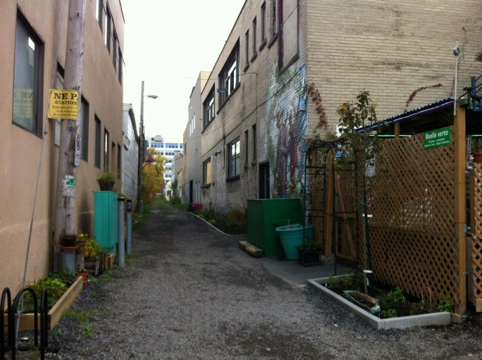
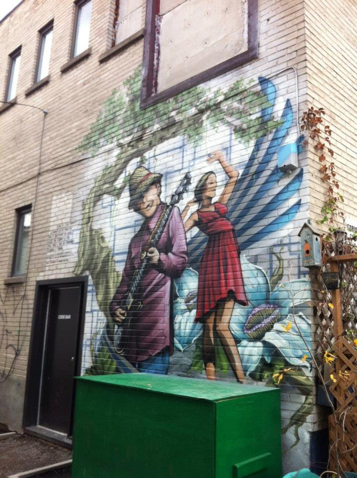

Situé entre Iberville, Masson, Dandurand, Chapleau.

Étrange ruelle, situé à deux pas des bureaux de l'arrondissement Rosemont Petite-Patrie, coincé entre des locaux
commerciaux. On a tenté de passer avec mes enfants en vélo et c'est difficllement praticable. Aucun entretien, des
tas de branchages abandonnés au milieu du chemin. 

_Visitée le 2020-06-02_

Revue de presse:
* [Une ruelle verte et « kool », Journal Métro, 16 avril 2012](https://journalmetro.com/actualites-rosemont-la-petite-patrie/639094/une-ruelle-verte-et-kool/)
* [Karaoké sobre, Journal Métro, 14 novembre 2011](https://journalmetro.com/actualites-rosemont-la-petite-patrie/636992/karaoke-sobre/)